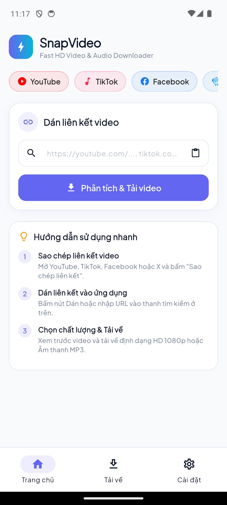

# NimbleClip

[](https://github.com/vannt-dev/nimbleclip/actions/workflows/ci.yml)
[](https://flutter.dev/)
[](https://dart.dev/)

**Save clips. Keep moments.**

NimbleClip is a Flutter application for discovering and downloading publicly
available video and audio streams from popular social platforms. It provides a
single, polished interface for link detection, quality selection, download
management, local playback, and gallery export.

> NimbleClip is intended for content you own, content in the public domain, or
> content you are authorized to download. You are responsible for complying
> with the source platform's terms and applicable copyright laws.



## Features

- Detects supported links pasted from the clipboard.
- Extracts available video and audio qualities before downloading.
- Tracks progress, transfer speed, and downloaded file size in real time.
- Pauses and resumes native downloads when the source server supports HTTP
  range requests.
- Refreshes expired media URLs before retrying a failed download.
- Previews remote media and plays downloaded files inside the app.
- Saves completed media to the device gallery on Android and iOS.
- Opens or shares downloaded files with other installed applications.
- Persists download history and user preferences locally.
- Supports light, dark, and system themes.
- Supports English and Vietnamese, with automatic device-locale detection and
  a persisted in-app language preference.
- Includes a browser build backed by a local, SSRF-hardened CORS proxy.

## Supported sources

| Source | Supported content |
| --- | --- |
| YouTube | Public videos and available M4A audio streams |
| TikTok | Public videos, including watermark-free variants when exposed by the source, and audio |
| Facebook | Public videos, Watch links, and Reels |
| X / Twitter | Public posts containing video |
| Instagram | Public video posts and Reels |
| Direct URLs | Public video/audio files and pages exposing standard Open Graph media metadata |

Extraction depends on public endpoints and page formats controlled by third
parties. A platform change, regional restriction, authentication requirement,
DRM protection, or expired signature may prevent a specific link from working.

## Platform support

The repository contains Flutter targets for Android, iOS, Windows, macOS,
Linux, and Web. Native targets provide the complete download workflow. The Web
target has browser-specific limitations and requires the included Node.js
server for cross-origin requests and downloads.

## Languages

- English (`en`)
- Vietnamese (`vi`)
- System default, with English used for unsupported device locales

Translations are maintained as ARB files in `lib/l10n`. Flutter generates the
typed localization API from these resources during dependency resolution and
builds.

## Getting started

### Prerequisites

- [Flutter](https://docs.flutter.dev/get-started/install) on the stable channel
- A platform toolchain for the target you want to run:
  - Android Studio and an Android SDK for Android
  - Xcode on macOS for iOS and macOS
  - Visual Studio with Desktop development with C++ for Windows
  - The Flutter Linux desktop prerequisites for Linux
- Node.js 22 or later when running the Web build or server tests

The exact Dart SDK constraint is defined in `pubspec.yaml`.

### Install

```bash
git clone https://github.com/vannt-dev/nimbleclip.git
cd nimbleclip
flutter pub get
git config core.hooksPath .githooks
```

The repository hooks enforce Conventional Commits, run formatting and static
analysis before commits, and run tests plus a release Web build before pushes.
Run `tool/check.sh all` at any time to execute every local gate.

### Verify the project

```bash
flutter analyze
flutter test
node --check server.js
node --test test/server_test.js
```

### Run the app

List the available targets:

```bash
flutter devices
```

Then launch NimbleClip on a selected target:

```bash
flutter run -d <device-id>
```

Examples:

```bash
flutter run -d windows
flutter run -d chrome
```

## Android integration test

The Android storage test uses a fixture server running on the host machine.
Start it in a separate terminal before running the test on a device or emulator:

```bash
node tool/fixture_server.js
```

```bash
flutter test integration_test/android_storage_test.dart -d <device-id>
```

The test covers file storage, download progress, pause/resume behavior, and
gallery export.

## Web build

Browsers block many cross-origin media requests made directly to social
platforms. NimbleClip's Web build therefore uses the local proxy in `server.js`.

```bash
flutter build web --release
node server.js
```

Open `http://127.0.0.1:8080` by default. The server accepts two optional
environment variables:

| Variable | Default | Purpose |
| --- | --- | --- |
| `HOST` | `127.0.0.1` | Address used by the local server |
| `PORT` | `8080` | HTTP port used by the local server |

### Proxy endpoints

| Endpoint | Purpose |
| --- | --- |
| `GET/POST /cors-proxy?url=<url>` | Proxies an HTTP request and forwards range headers for media seeking. Add `filename=<name>` to return a download response. |
| `GET /resolve?url=<url>` | Resolves redirects for shortened links such as `t.co`, `fb.watch`, and `vm.tiktok.com`. |

The proxy only accepts HTTP and HTTPS destinations on ports 80 and 443. It
validates every redirect and rejects loopback, private, link-local, and other
non-public destination addresses to reduce SSRF risk. Static files are served
only from `build/web`.

Some YouTube streams use `signatureCipher`, which requires YouTube's JavaScript
signature transformation and is not currently handled by the Web extractor.
Use a native build when a stream is unavailable in the browser.

## Build artifacts

```bash
# Android APK
flutter build apk --release

# Android App Bundle
flutter build appbundle --release

# Web
flutter build web --release

# Windows, macOS, or Linux (run on the matching host OS)
flutter build windows
flutter build macos
flutter build linux
```

Release builds may require platform-specific signing configuration before they
can be distributed through an app store.

## Project structure

```text
lib/
|-- core/
|   |-- constants/       App-wide values and storage keys
|   |-- theme/           Material themes and colors
|   `-- utils/           URL, HTTP, parsing, quality, and file helpers
|-- models/              Video metadata and download task models
|-- providers/           Application state and workflow coordination
|-- services/
|   |-- extractors/      Platform-specific media extractors and registry
|   |-- download_service.dart
|   `-- storage_service.dart
|-- views/               Home, downloads, player, and settings screens
`-- main.dart            Application entry point

integration_test/        Device-level Android storage tests
test/                    Flutter unit, widget, fixture, and Node server tests
tool/                    Local integration-test fixture server
server.js                Web static server, URL resolver, and CORS proxy
```

## Storage and permissions

### Android

- `INTERNET` and `ACCESS_NETWORK_STATE` are required for extraction and
  downloads.
- `WRITE_EXTERNAL_STORAGE` is limited to Android 10 and earlier for legacy
  gallery export support.
- Android 11 and later use scoped storage and MediaStore.
- Active files are stored under the app-specific external directory at
  `Android/data/com.vannt.nimbleclip/files/NimbleClip` before optional gallery
  export.
- Cleartext HTTP is disabled by default and only explicitly allowed for the
  small set of media CDNs declared in the network security configuration.

### iOS

NimbleClip declares photo-library usage descriptions for saving downloaded
media. App Transport Security exceptions are configured for remote media
streams that do not support the default policy.

## Continuous integration

The GitHub Actions workflow runs on every pull request and every push to
`main`. It validates commit messages and formatting, performs Flutter static
analysis and tests, checks an Android build and a release Web build, and runs
the Node server checks. Pushing a matching `vX.Y.Z` tag starts the signed
release workflow documented in [RELEASING.md](RELEASING.md).

## Contributing

Issues and pull requests are welcome. Before submitting a change, run:

```bash
tool/check.sh all
```

Use a Conventional Commit subject such as `fix(web): reject unsafe redirects`.

Keep extractor changes focused and include a sanitized fixture test whenever a
third-party response format is involved. Never commit authentication tokens,
cookies, private media, or personal account data.

## Disclaimer

NimbleClip is not affiliated with, endorsed by, or sponsored by YouTube,
TikTok, Meta, Instagram, Facebook, or X. Product names and trademarks belong to
their respective owners.
